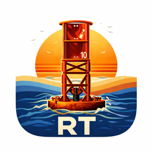
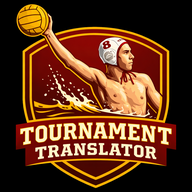
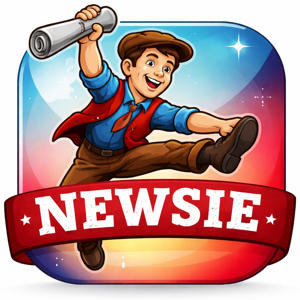

# DJ — AI Agents

Building applied AI agents for real-world coordination problems in sports, media, and logistics.

---

<table>
  <tr>
    <td width="100" align="center" valign="top">
      
    </td>
    <td valign="top">
      <strong>Artie</strong> &nbsp;·&nbsp; <a href="https://artie-production-1b13.up.railway.app">↗ Live App</a> &nbsp;·&nbsp; <a href="https://github.com/R10ForTheWin/artie">Code</a>  
      AI coordination platform for a 10-person prone paddle crew training for the 32-mile Catalina Classic. Tracks training mileage, race schedules, team records, and live ocean conditions.
    </td>
  </tr>
  <tr><td colspan="2"> </td></tr>
  <tr>
    <td align="center" valign="top">
      
    </td>
    <td valign="top">
      <strong>Tournament Translator</strong>  
      Water polo tournament scheduling tool that decodes complex multi-game formats — bracket progression, overlapping matches, and pool play — into a clean, easy-to-follow schedule.
    </td>
  </tr>
  <tr><td colspan="2"> </td></tr>
  <tr>
    <td align="center" valign="top">
      
    </td>
    <td valign="top">
      <strong>Reggie</strong>  
      Lightweight training management system for swim teams. Handles practice scheduling, attendance tracking, and workout organization with a mobile-first interface.
    </td>
  </tr>
  <tr><td colspan="2"> </td></tr>
  <tr>
    <td align="center" valign="top">
      
    </td>
    <td valign="top">
      <strong>Newsie</strong> &nbsp;·&nbsp; <a href="https://github.com/R10ForTheWin/newsie">Code</a>  
      AI-powered news reader that blends real headlines with Onion-style satire — keeping the news digestible without losing the plot.
    </td>
  </tr>
  <tr><td colspan="2"> </td></tr>
  <tr>
    <td align="center" valign="top">
      
    </td>
    <td valign="top">
      <strong>Justin EMBAlake</strong> &nbsp;·&nbsp; <a href="https://github.com/R10ForTheWin/ucla_parking">Code</a>  
      Autonomous AI agent that monitors UCLA parking inventory around the clock and automatically purchases a pass the moment one becomes available.
    </td>
  </tr>
  <tr><td colspan="2"> </td></tr>
  <tr>
    <td align="center" valign="top">
      
    </td>
    <td valign="top">
      <strong>Map Quiz</strong> &nbsp;·&nbsp; <a href="https://github.com/R10ForTheWin/map-quiz">Code</a>  
      Interactive geography learning tool for 5th graders — covering US states and capitals as well as international maps.
    </td>
  </tr>
  <tr><td colspan="2"> </td></tr>
  <tr>
    <td align="center" valign="top">
      <strong>🎨</strong>
    </td>
    <td valign="top">
      <strong>Deckie</strong>  
      AI-powered slide gradient tool that applies intelligent color overlays and background treatments to presentation slides using OpenAI vision models.
    </td>
  </tr>
</table>

---

More agents coming soon.
